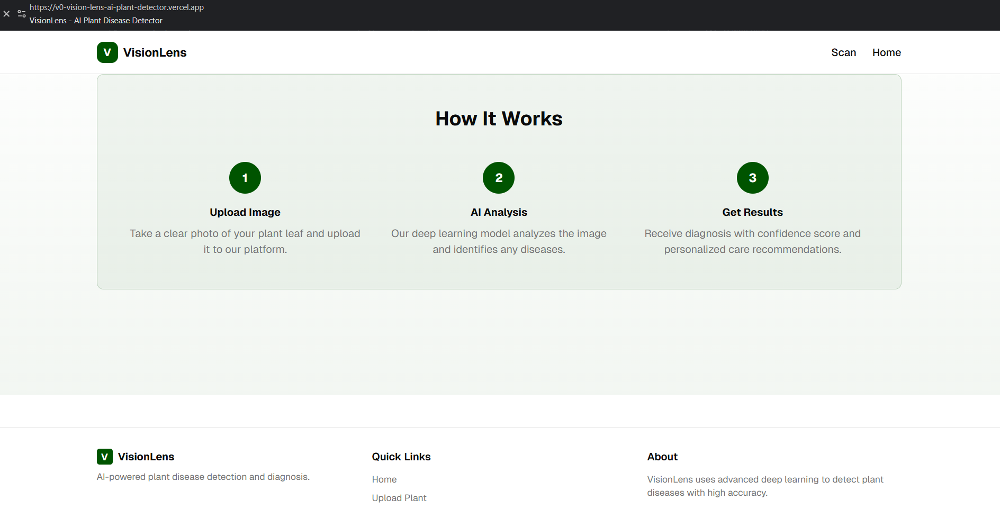
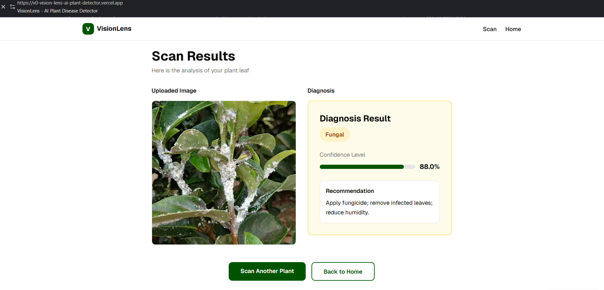

# 🌿 VisionLens — AI Plant Disease Detector

## 🌱 Project Overview

VisionLens is an AI-powered web application that detects plant leaf diseases using deep learning and provides confidence scores and cure suggestions in real time.

---

## 🔍 Why Plant Disease Detection Matters

1.Early detection prevents large-scale crop loss

2.Helps farmers take timely action

3.Improves agricultural productivity

4.Reduces dependency on manual inspection

---

## 🧠 How It Works

-User uploads a plant leaf image

-Image is processed using a TensorFlow deep learning model

-The model predicts the disease with a confidence score

-The app displays disease name, accuracy, and treatment suggestions

---

## 🚀 Live Demo

--> 🔗 Try it here:
👉 https://v0-vision-lens-ai-plant-detector.vercel.app/

---

## 📸 Project Screenshots

1.🏠 Home Page

  

2.ℹ️ About Page

  

3.📷 Scan Image Page

  

4.📊 Result Page

  

---

## ✨ Features

📤 Image upload with live preview

🌿 AI-powered plant disease classification

📈 Confidence score visualization

💊 Cure & prevention suggestions

⚡ Fast TensorFlow inference via Vercel Serverless Functions

📱 Fully responsive UI using Tailwind CSS

🎨 Clean, modern Next.js App Router design

---

## 🛠️ Tech Stack

| Frontend | Deployment | 
|-----------|----------|
| Next.js (App Router) , TypeScript , Tailwind CSS , AI / ML , TensorFlow , Deep Learning (CNN-based model) | Vercel , Serverless Functions |

---

## 🎯 Use Case

✅ Portfolio flagship project

✅ Internship / placement showcase

✅ AI + Web integration demo

✅ Agriculture & sustainability solution

---

## 🧠 What I Learned

1.Integrating AI models with modern web frameworks

2.Handling image-based inference in serverless environments

3.Building responsive UIs with Tailwind CSS

4.Deploying full-stack AI apps on Vercel

---

## 🚀 Future Enhancements

🌍 Multi-language support for farmers

📸 Real-time camera capture

🌾 Support for more plant species

📊 Disease history & analytics dashboard

📄 License

---

## 📄 License

This project is licensed under the **MIT License** — free to use, modify, and distribute.

---

This project is licensed under the MIT License — free to use, modify, and distribute.

 ## ⭐ If you like this project, consider giving it a star!
